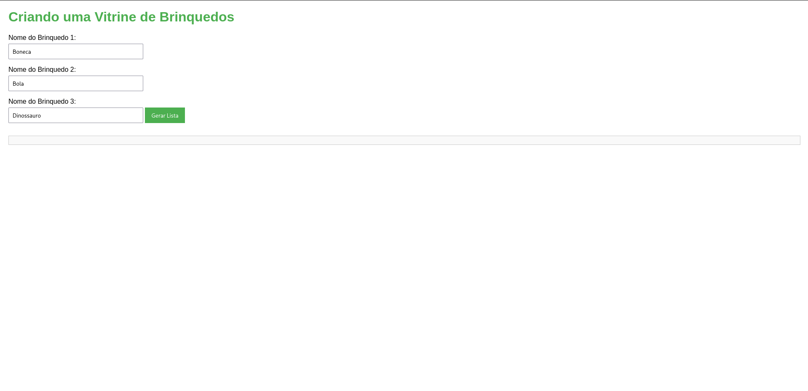

# `Vitrine de Brinquedos`

## Descrição

O projeto **Vitrine de Brinquedos** é uma aplicação web simples que permite aos usuários inserir os nomes de três brinquedos e exibi-los em uma lista organizada. A aplicação utiliza HTML, CSS e JavaScript para proporcionar uma experiência interativa.

## Estrutura do Projeto

A estrutura do projeto é a seguinte:

```
VitrineDeBrinquedos/
├── assets
│   ├── css
│   │   └── style.css
│   ├── images
│   │   └── tela.png
│   └── scripts
│       └── script.js
└── index.html
```

- **index.html**: O arquivo principal da aplicação que contém a estrutura HTML.
- **assets/css/style.css**: O arquivo CSS que estiliza a aplicação.
- **assets/scripts/script.js**: O arquivo JavaScript que adiciona interatividade à aplicação.
- **assets/images/tela.png**: Imagem representativa da aplicação.

## Instalação

Para executar o projeto localmente, siga os seguintes passos:

1. Clone o repositório (ou baixe o projeto).
   ```bash
   git clone <URL-do-repositório>
   ```
2. Navegue até a pasta do projeto.
   ```bash
   cd VitrineDeBrinquedos
   ```
3. Abra o arquivo `index.html` em seu navegador.

## Uso

1. Na página inicial, você verá campos para inserir o nome de três brinquedos.
2. Preencha os campos e clique no botão "Gerar Lista".
3. A lista dos brinquedos aparecerá abaixo, formatada de maneira organizada.

## Demonstração



## Tecnologias Utilizadas

- HTML
- CSS
- JavaScript

## Contribuições

Se você quiser contribuir com o projeto, fique à vontade para abrir uma `issue` ou enviar um `pull request`.

## Licença

Este projeto está licenciado sob a MIT License. Veja o arquivo `LICENSE` para mais detalhes.
```

