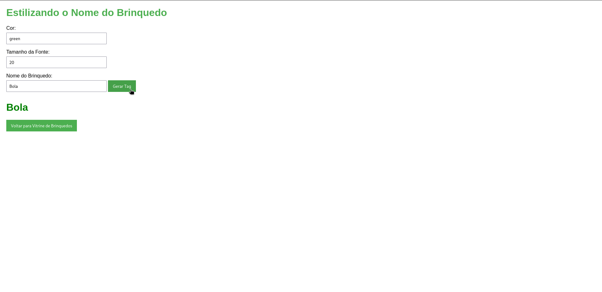

# `Vitrine de Brinquedos`

## Descrição

Este projeto consiste em duas páginas web que permitem interagir com a estilização e apresentação de brinquedos. A primeira página exibe uma lista de brinquedos, enquanto a segunda permite ao usuário estilizar o nome de um brinquedo com cor e tamanho de fonte.

## Estrutura do Projeto

```
VitrineDeBrinquedos/
├── assets/
│   ├── css/
│   │   └── style.css
│   ├── images/
│   │   ├── estilizando.png
│   │   └── tela.png
│   └── scripts/
│       ├── estilizando.js
│       └── script.js
├── estilizando.html
├── index.html
└── README.md
```

## Páginas do Projeto

### 1. Vitrine de Brinquedos

A página **Vitrine de Brinquedos** permite que o usuário insira o nome de três brinquedos e gere uma lista formatada. O resultado é exibido na própria página.

#### Funcionamento

- O usuário preenche três campos de texto com os nomes dos brinquedos.
- Ao clicar no botão "Gerar Lista", a lista é gerada e exibida na tela.

#### Exemplo


### 2. Estilizando o Nome do Brinquedo

A página **Estilizando o Nome do Brinquedo** permite que o usuário insira uma cor, um tamanho de fonte e o nome de um brinquedo. O resultado é exibido em uma tag HTML `<h1>` estilizada.

#### Funcionamento

- O usuário insere a cor, o tamanho da fonte e o nome do brinquedo.
- Ao clicar no botão "Gerar Tag", a tag estilizada é gerada e exibida na tela.

#### Exemplo



## Como Usar

1. Abra o arquivo `index.html` em um navegador para acessar a **Vitrine de Brinquedos**.
2. Preencha os campos e clique em "Gerar Lista".
3. Para acessar a página de **Estilizando o Nome do Brinquedo**, clique no botão correspondente.
4. Na nova página, insira os dados e clique em "Gerar Tag" para visualizar o resultado.

## Tecnologias Utilizadas

- HTML
- CSS
- JavaScript
```


## Licença

Este projeto é de propriedade de Douglas Lucio - IonKod.

Você pode utilizar, modificar e distribuir este projeto sob as seguintes condições:

- Acreditamos que o conhecimento deve ser compartilhado. Portanto, sinta-se à vontade para usar e adaptar o código conforme necessário.
- Ao redistribuir ou modificar o código, por favor, mantenha esta nota de crédito ao autor original.
Para mais informações, entre em contato: Douglas Lucio - IonKod.
